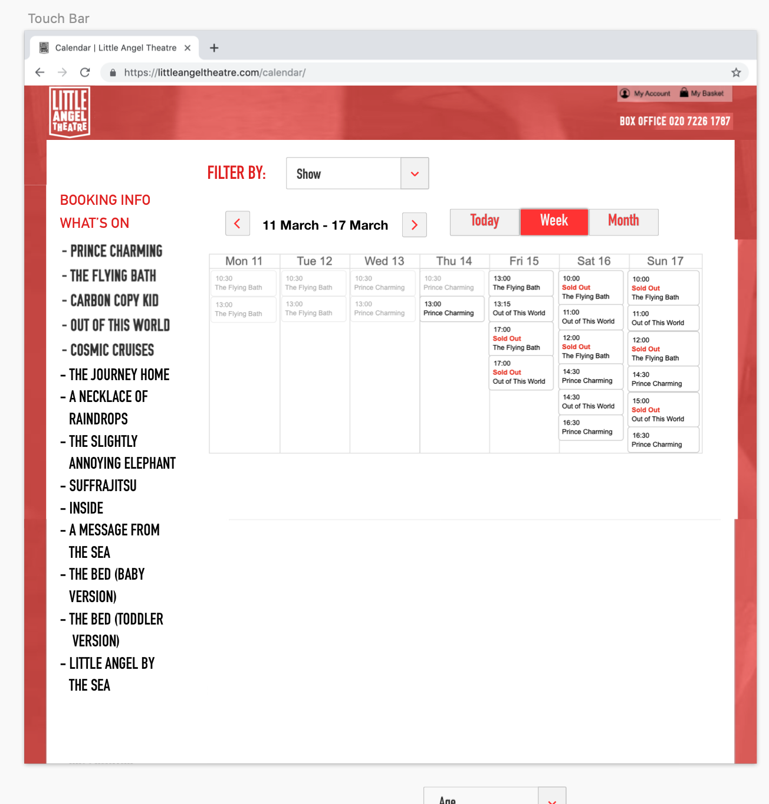

# Little Angel Theatre

## About

Little Angel Theatre, the only puppetry theatre for children in London.

They would like to make their booking system more user friendly and professional as it's very text heavy at the moment, also they are aiming to increase their website speed and performance particularly the calendar page.
We conducted seven user interviews which informed our design. 

## Links

The link to the website is: https://littleangeltheatre.com/

## Acknowledgement

We are doing a lot of styling work directly on the Spektrix and WordPress platforms.
We have also built an interactive dashboard using Google Data Studio tailored to Little Angel Theatres needs, so that they can monitor site performance over time, and see if there has been an uplift in sales following the website updates. 

The calendar page mockup design

## Contributors

Last, but not least, names of the proud contributors please!

| Name | GitHub | Twitter | LinkedIn | Other |
| :--- | :--- | :--- | :--- | :--- |
| Mahsa Dilmaghani | https://github.com/mahsadilmaghani | https://twitter.com/m_dilmaghani | https://www.linkedin.com/in/m-dilmaghani/ |
| Amina Adewusi | https://github.com/nirvikalpa108 | https://twitter.com/a_adewusi | https://www.linkedin.com/in/aadewusi/ |
| Sabrina Wons | -- | -- | https://www.linkedin.com/in/sabrina-wons-886020120/ |
| Rachel Lally | -- | -- | https://www.linkedin.com/in/rachel-lally-36110698/ |
| Courtney Wheeler | UX | -- | https://www.linkedin.com/in/cwheeler121 |
| Jihyun Hwang | http://github.com/Whooolia | -- | http://www.linkedin.com/in/whoooolia |
| Jane Maguire | http://github.com/janemaguire | https://twitter.com/realslimjaney | https://www.linkedin.com/in/jane-maguire |
